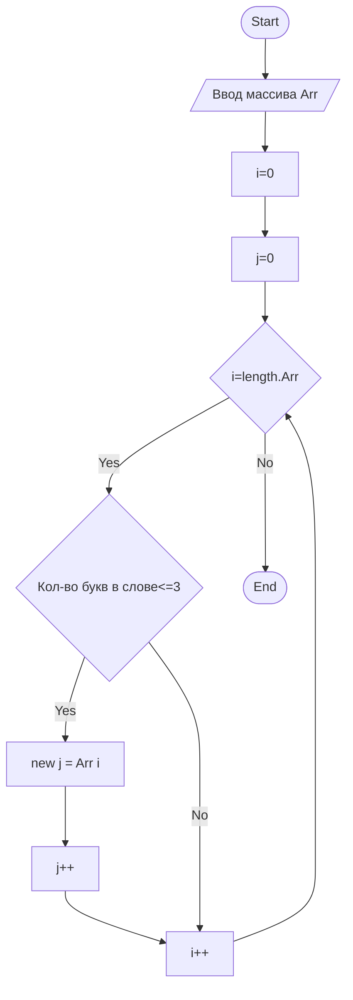

```mermaid
graph TD;
    node1([Start]) --> node2[/Ввод массива Arr/];
    node2[/Ввод массива Arr/] --> node3[i=0];
    node3[i=0] --> node4[j=0];
    node4[j=0] --> node5{i=length.Arr};
        node5{i=length.Arr} --> |Yes| node6{Кол-во букв в слове<=3};
            node6{Кол-во букв в слове<=3} --> |Yes| node7[new j=Arr i];
            node7[new j = Arr i] --> node8[j++];
            node8[j++] --> node9[i++];
            node6{Кол-во букв в слове<=3} --> |No| node9[i++];
        node9[i++] --> node5{i=length.Arr};
        node5{i=length.Arr} --> |No| node10([End]);
```
